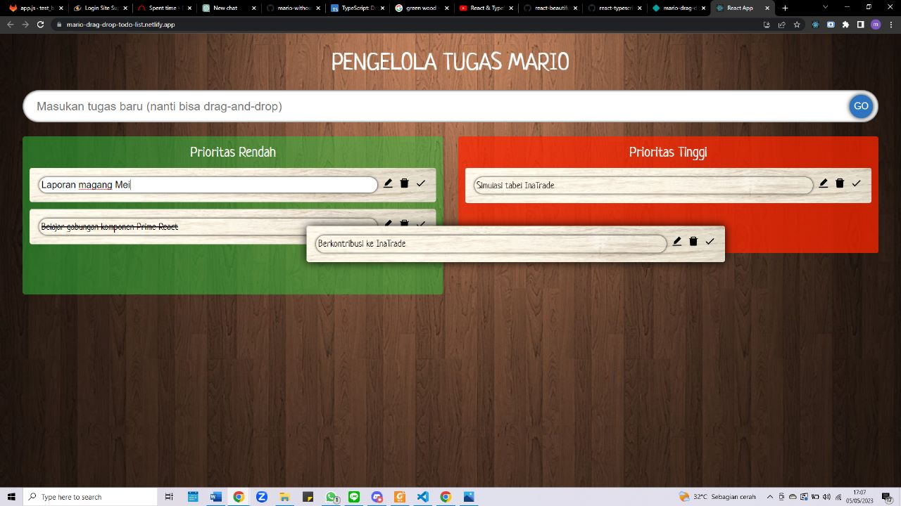

# Todo List (Drag-and-Drop)

---

A To-do List project, but with Drag & Drop functionality. The npm for drag-and-drop is bugged during development, but it works fine once deployed.

Project made by Mario (with some of my own code modifications).

Project is hosted by Netlify. It can be viewed [here](https://mario-drag-drop-todo-list.netlify.app/).

---

Some screenshots:

---

The tutorial video can be found [here](https://www.youtube.com/watch?v=FJDVKeh7RJI&list=WL&index=10&pp=gAQBiAQB)

.